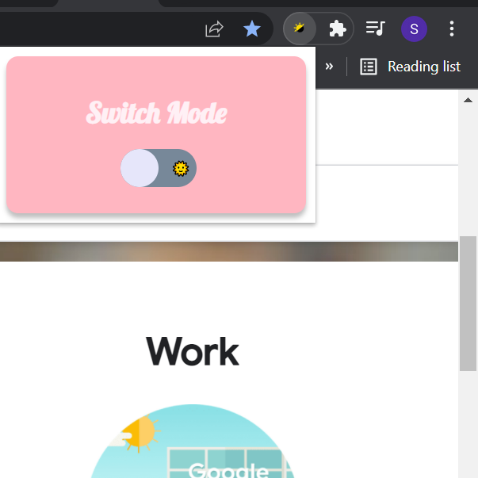
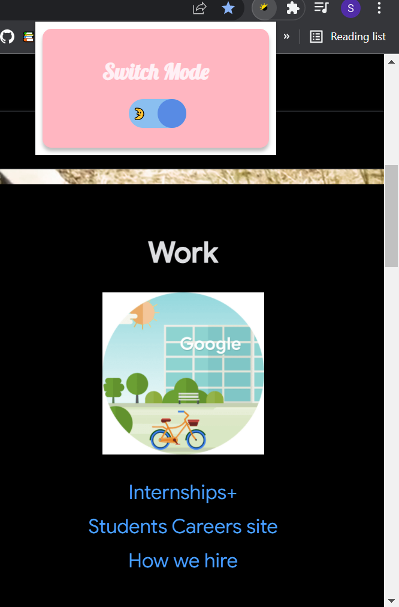
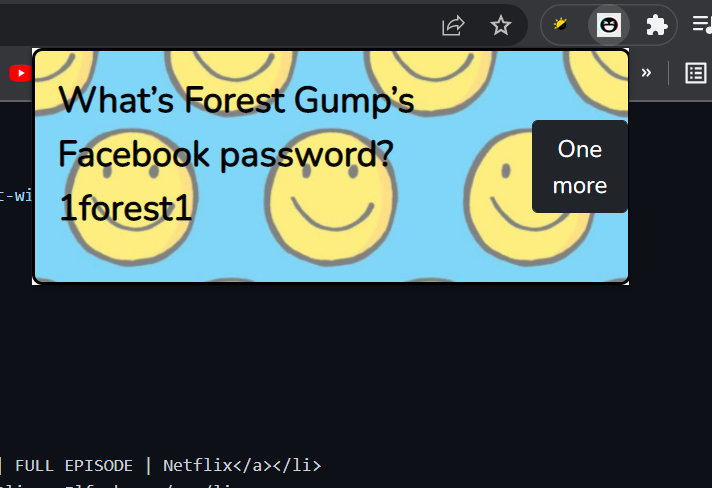

<br />
<p align="center">
  <a href="https://github.com/othneildrew/Best-README-Template">
    
  </a>

  <h3 align="center">Chrome extenstions</h3>

  <p align="center">
    Extenstions to increase productivity 
    <br />
    <br />
</p>

<!-- TABLE OF CONTENTS -->
<details open="open">
  <summary>Table of Contents</summary>
  <ol>
    <li>
      <a href="#about-the-project">About The Project</a>
      <ul>
        <li><a href="#built-with">Built With</a></li>
      </ul>
    </li>
    <li>
      <a href="#getting-started">Getting Started</a>
      <ul>
        <li><a href="#prerequisites">Prerequisites</a></li>
        <li><a href="#installation">Installation</a></li>
      </ul>
    </li>
    <li><a href="#contact">Contact</a></li>
    <li><a href="#acknowledgements">Acknowledgements</a></li>
  </ol>
</details>
<!-- ABOUT THE PROJECT -->

## About The Project

Google Chrome extensions are programs that can be installed into Chrome in order to change the browser's functionality. This includes adding new features to Chrome or modifying the existing behavior of the program itself to make it more convenient for the user

A list of commonly used resources that I find helpful is listed in the acknowledgments.

### Switch Mode Extenstion🌞/🌛



The human pupil is sensitive to the amount of light while some might prefer reading web pages in dark mode, some would rather switch dark web pages to light mode. In such cases having a chrome extenstion to make sure user views web pages in whichever contrast they desire, Switch Mode Extenstion comes in handy
### Jokes Extenstion

Bored of working? Need something to relieve the over load for few minutes? Jokes Extenstion comes in handy in cases where you need jokes to laugh of that day overflowing with pending tasks

### Built With

I've used the following frameworks and tools in my project:

- [CSS](https://developer.mozilla.org/en-US/docs/Learn/CSS/First_steps/Getting_started)
- [HTML](https://www.htmlpad.net/download.php)
- [Javascript](https://www.javascript.com/)

<!-- GETTING STARTED -->

## Getting Started

To get a local copy up and running follow these simple example steps.

### Prerequisites

List of things you might need:

- CSS, HTML and Javascript extensions

### Installation

1. Make sure you got HTML, CSS and Javascript extenstions
2. Clone the repo

   ```sh
   https://github.com/soumya530G/ChromeExtenstions.git
   ```

   You're good to go!

<!-- CONTACT -->

## Contact

Soumya Gupta <br>
[Twitter](https://twitter.com/@SoumyaG22868897), [Github](https://github.com/soumya530G),
[Linkedin](https://www.linkedin.com/in/soumya-gupta-595a52208/)  
Email: soumyamns002@gmail.com <br>  
Project Link: [https://github.com/soumya530G/ChromeExtenstions.git](https://github.com/soumya530G/ChromeExtenstions.git) <br>

<!-- ACKNOWLEDGEMENTS -->

## Acknowledgements

- [Google Fonts](https://fonts.google.com/)
- [README template](https://github.com/othneildrew/Best-README-Template/blob/master/README.md#built-with)<br>
- Pictures:
    <ul>
      <li><a href="https://www.dreamstime.com/puzzle-line-icon-black-background-flat-style-vector-illustration-image170442639">Dreamstime</a></li>
      <li><a href="https://www.microsoft.com/en-us/p/sun-moon/9mt73vbd3kqg#activetab=pivot:overviewtab">Microsoft</a></li>
    </ul>
- YouTube:
    <ul>
      <li><a href="https://www.youtube.com/watch?v=gtF2nHVjqFk&t=391s">Chrome Extension Development Tutorial</a></li>
      <li><a href="https://www.youtube.com/watch?v=8qlPbPenb4I">Chrome Extensions Explained</a></li>
    </ul>

<!-- MARKDOWN LINKS & IMAGES -->
<!-- https://www.markdownguide.org/basic-syntax/#reference-style-links -->

[contributors-shield]: https://img.shields.io/github/contributors/othneildrew/Best-README-Template.svg?style=for-the-badge
[contributors-url]: https://github.com/othneildrew/Best-README-Template/graphs/contributors
[forks-shield]: https://img.shields.io/github/forks/othneildrew/Best-README-Template.svg?style=for-the-badge
[forks-url]: https://github.com/othneildrew/Best-README-Template/network/members
[stars-shield]: https://img.shields.io/github/stars/othneildrew/Best-README-Template.svg?style=for-the-badge
[stars-url]: https://github.com/othneildrew/Best-README-Template/stargazers
[issues-shield]: https://img.shields.io/github/issues/othneildrew/Best-README-Template.svg?style=for-the-badge
[issues-url]: https://github.com/othneildrew/Best-README-Template/issues
[license-shield]: https://img.shields.io/github/license/othneildrew/Best-README-Template.svg?style=for-the-badge
[license-url]: https://github.com/othneildrew/Best-README-Template/blob/master/LICENSE.txt
[linkedin-shield]: https://img.shields.io/badge/-LinkedIn-black.svg?style=for-the-badge&logo=linkedin&colorB=555
[linkedin-url]: https://linkedin.com/in/othneildrew
[product-screenshot]: images/screenshot.png
